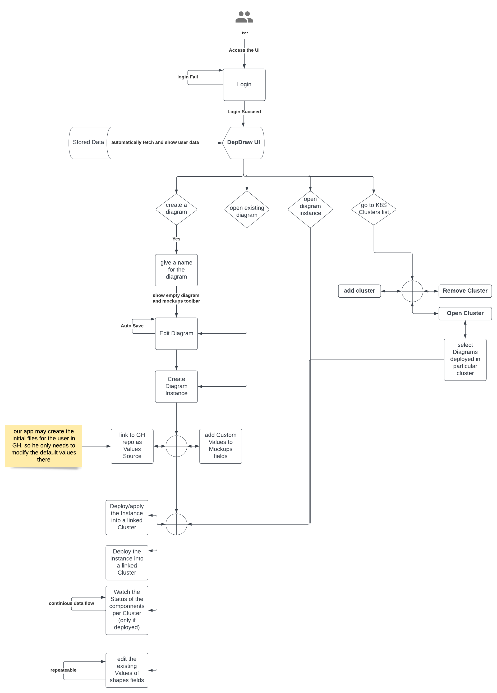

# DepDraw

---

 
 

## Background
K8s/OpenShift Deployment proccess is something that happens every single second in the Industry, where CD and DevOps Tools is making it easier, but still pepole need to deal with complicated manifests and files, requiring them to have knowlage of K8S resources and Patterns.
for that a CD Tool idea of managing those Deployment Processes using Mockups and GUIs will help the industry run and manage the Deployments of K8S using Graphical Diagrams and Mockups,
which will require less coding skills, and less debuging needs, and let pepole focus on Buisness items instead of technical issues.
 
 

---
## Requirements 
 
 

---
## Non functional
Technical requirement - scalability/availability/throughput/ storage 
- the Product will require to be a HA System.

- may require Scalability of some of its componnents(e.g if we are monitoring some K8S project using the DepDraw, the number of resources being monitored, will detrmine the scale of the DepDraw componnent that monitor it)

- the product require a high UX level so it should not have issues such like Lag or delays when pepole are drawing shapes or viewing their diagrams, this may require us to use in-memory storag.
- the product should focus on supporting OCP at the first level (things that cant be done with Raw K8S is fine)

 
 

---
## Proposed solution
as part of the general direction of the Project, we have tested some of the existing solutions, but non of them were fiting/including all of the features we were willing to have.
we have checked the following solutions:
- Openshift Topology View: the Topology viewq of openshift has the ability to visualise existing componnents as Mockups, but it doesnt have the ability to create componnents using Drag&Drop of Mockups, additionally there is no way to modify exisitng things from the diagram view.
- for visualising we havce tested some solutions, but those solutions has no ability to continiously update according to the state change of the K8s/OCP componnents inisde a cluster.

for that our currently direction is to develop our own UI, so we could support our expected features from the beginning, which also guarantee for us not to face comaptability issues when developing a new feature.

the solution will include both ways syncing of diagram->k8s OR k8s->diagram

 
 

---
## High level design of proposed solution 
Describe components/flow/process 
Componnents
- a browser based UI, which will be used for managing a User Diagarams and Clusters, it must allow 3 main things, the Drag&Drop of mockups for drawing diagrams, the ability to open an instance of a deployed diagram and see lives status of the corresponding componnents, the ability to manage and view saved diagrams and instances that the user made previously

- an api server which will be managing all of the interactions with K8S/OCP clusters, such when deploying a diagram, or willing to see a deployed diagram status, or when a user is logging-in

- we may make use of RH/OpenSource solutions that may help us not to envent the wheel for all of the product parts, such like using RH-SSO for managing Authintication
&Authorization, or any other product that the team and the contributors propose and agree about it.

 
 

---
## flows/proccess
the main usage flows that expected to exist in the project is as following, any other things that the team agree about can be added.

 
 

---
## Project plan 

### milestones
 
 

- get the team to start Contributing
- start the development
- have a way for automatically letting our project understand CRs in K8S.
- have a minimal Functional FE.
- have a minimal Functional BE.

### Communication & Meetings
 
 

- the Project will require the Team to sync once every 2 weeks.

- during the first 3 weeks the Contributors will be syncing weekly.

- Contributors may schedule non-repeatable meetings for their own sync with other Contributors.

- issues will be tracked on GH-issues.

- Assgiment of task will be of kind Pull (Contributors will pickup the tasks they are ok to work on)

### Needed Skills
 
 

- developers with Experience on integrating a PL with K8S-API.
- at lease 1 Contributor with K8S Administration BackGround.
- Web Based UI as the project GUI.
- at least 1 Contributor that can lead a project where he can take decisions when Contributors cant take their own.

### Tasks-Breakdown
 
 

- have our 1st meeting for creating a startpoint and for the initial task assgiment.
- Desgin how our app will handle the DATA (requires an experienced developer)
  - how K8S Resources will be saved in our app
  - weather we have a need to use a memory based DB
  - how we will linking shapes to K8S resources
  - Relation-ship between (K8S Clusters, K8S Resources, Diagrams, Shapes, Users and Diagrams-instances)

- Desgin the initial functionalities we need for leting the project grow easily from it.
- other tasks will be added when 1st meeting occur.

---
## Open point to discuss 

- are we going to use an ad-on as our Drawing tool, or we are developing our own.
- what programing languages and Technologies are going to be needed/used.
- where are we starting.